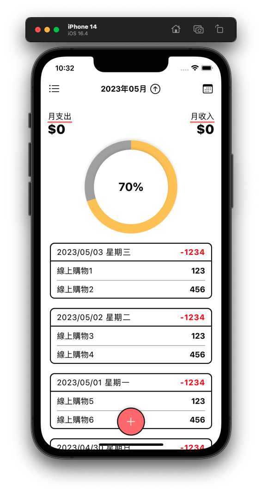
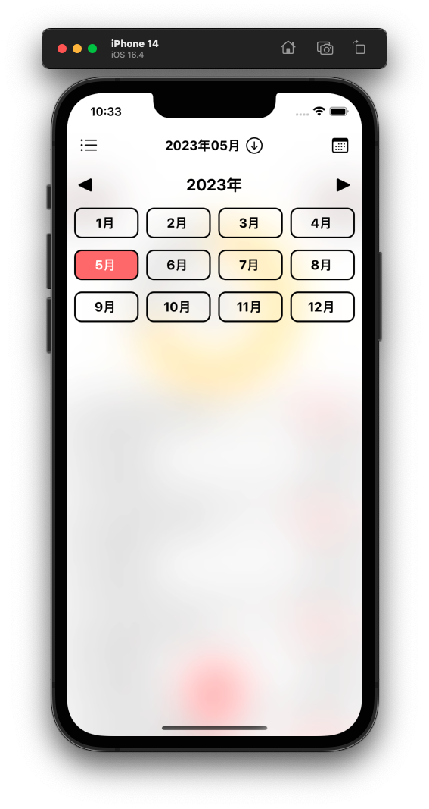

# Moneybook iOS

   

| | | | |
| - | - | - | - |
|  |  |  |  |
|  |  | ||

## Languages & Tools

## Feature

- Accelerate development with  [PDExtension Swift](https://github.com/pardnchiu/PDExtension-swift).
- Use [Font Awesome 6](https://fontawesome.com/v6/search) icons.

## Contributor

### 邱敬幃 Pardn Chiu

&nbsp&nbsp

 
 
 

